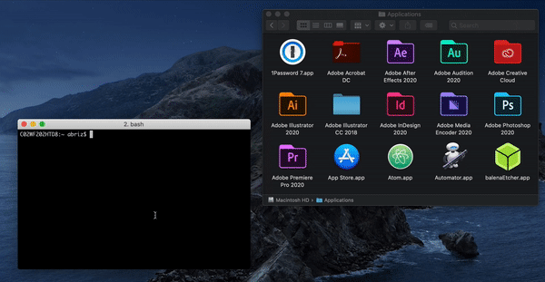

# Artisan

A suite of tools for creating & managing Adobe Illustrator based embeds. Heavily inspired by and built upon [ai2html](http://ai2html.org/).

## Contents
- [Why This?](#why-this)
- [How's It Work?](#hows-it-work)
- [Artisan In Action](#artisan-in-action)
- [CLI Usage](#cli-usage)
- [Installation](#installation)

## Why This?
When The New York Times created ai2html in 2015, it revolutionized the way online graphics teams published their work on the web. For the first time, a graphic artist could export an Adobe Illustrator file to the internet as web-friendly HTML instead of as a flat image, preserving text for SEO and maintaining responsiveness across all devices.

That said, the world of online web development has changed drastically for news developers in the last five years. POLITICO, like many other newsrooms, now uses React and React components as the building blocks of all their interactive pages. Some newsrooms like The Washington Post are even moving to using React for every page on their website. Because of these changes, a large gap has grown between coders (who work with component-based JavaScript code) and non-coding graphic designers (who can only provide static HTML output by ai2html).

POLITICO created Artisan to close that gap, taking the groundbreaking foundation laid by ai2html and updating it for the modern world with a few extra quality-of-life features. Where ai2html produces static HTML, Artisan exports Adobe Illustrator files as React components. By allowing any Adobe Illustrator file to be saved as a component, an illustration can be easily plugged into an existing React project or reused across multiple projects.

While Artisan's practical uses are clear, it was also created as an easy and useful first step for our graphic designers to enter the developer world by introducing them to concepts like command lines, GitHub, and web components.

Whether you're a news developer, a graphic designer or an editor: Artisan's suite of tools makes collaboration easier than ever without having to make sacrifices to your workflow.

## How's It Work?
And unlike its predecessor, Artisan is more than an Adobe Script, featuring a fully fledged command line tool that can be used to create new interactive projects.. What typically could be a messy handoff between a designer and a developer is now simple — the designer creates a graphic, spins up an interactive project to house it, and sends it to a developer for finishing touches.

Artisan's command line tool also handles file and project management. With simple commands like "art new", "art activate", "art archive", "art open", and "art pub," users can move a project from a basic template to a published page without ever having to find a single file on their computer. Because all the file-management is handled by Artisan, users can also plug into their company's existing GitHub architecture. This means with simple commands like "art save" and "art download", entire projects (Illustrator files and all) can be viewed on GitHub and shared between designers, developers, and editors.

## Artisan In Action

### As An Embed
[This historical chart on the unemployment rate](https://www.politico.com/interactives/2020/embed/unemployment-april-2020-line-chart-hnNE7Ja6/preview/) was easily plugged into [a story](Unemployment soars to 14.7 percent in April amid coronavirus fallout) on the unemployment rate and [a deeper analysis](https://www.politico.com/news/2020/05/08/when-will-jobs-return-243925?Asks) on the future of the job market. The graphic designer built the chart completely in Adobe Illustrator, and then ran a single command to grab an embed code to use in any article page. You can see the [embed's repo here](https://github.com/The-Politico/illustration_unempline0420).

### As Part of a Story
A designer worked on [a single scatterplot](https://www.politico.com/interactives/2020/coronavirus-activity-risk-what-is-safe-poll/#g-Scatterplot-Desktop-img) showing the results of a survey in Adobe Illustrator. Then, she used Artisan to save her work as a component, which was slotted in with other interactive components to make a custom page. The designer didn't have to think about the page, and the developer imported the scatterplot the same way they would import any other piece of code. You can see the [story's repo here](https://github.com/The-Politico/interactive_coronavirus-activity-risk).

## CLI Usage

```
Usage:
  art <command> [options]

Commands:
  art activate [project]         Sets a project to be active
  art archive [project]          Archives a project
  art code                       Opens the active project in Atom
  art conf                       Open the artisan conf file
  art deactivate                 Sets no project to be active
  art delete [type] [selection]  Delete something
  art dir                        Open the artisan projects folder
  art download [repo]            Downloads (or syncs) a project from GitHub
  art github                     Opens the active project's GitHub page.
  art install [illustrator]      Installs ai2jsx on your computer
  art new [type]                 Creates something new
  art open [illustration]        Open an illustration
  art pub [environment]          Publish the embed live
  art save [message]             Saves latest changes to GitHub
  art start                      Start a development server
  art unarchive [project]        Unarchives a project
  art update [project]           Updates Artisan to the latest version
  art which                      Find out what the active project is

Options:
  --version      Show version number                                   [boolean]
  --verbose, -v  Log info & errors to the console      [boolean] [default: true]
  --skip-health  Skip the health checks               [boolean] [default: false]
  --howto        Show help                                             [boolean]
```


## Installation

Artistan was custom-made for POLITICO and as such is very opinionated about project organization and publishing strategy. If you're not a member of POLITICO's team, these instructions may not make the most sense.

Install `@politico/interactive-bin`
```
$ npm install -g @politico/interactive-bin
```

Setup `@politico/interactive-bin`
```
$ pib setup
```

You'll need the following things from your AWS, Google Service Account, and GitHub setup:

**From AWS**
- AWS_ACCESS_KEY_ID: AWS Credential
- AWS_SECRET_ACCESS_KEY: AWS Credential
- DEFAULT AWS_BUCKET_NAME: Name of AWS S3 Bucket
- DEFAULT AWS_BASE_URL: Base URL for that Bucket (e.g. "http://bucket-name.s3.amazonaws.com/")
- STAGING AWS_BUCKET_NAME: Name of AWS S3 Bucket
- STAGING AWS_BASE_URL: Base URL for that Bucket
- PRODUCTION AWS_BUCKET_NAME: Name of AWS S3 Bucket
- PRODUCTION AWS_BASE_URL: Base URL for that Bucket

**From GitHub**
- GITHUB_TOKEN: Personal access token from GitHub

**Not Necessary For Artisan**
- GAPI_PRIVATE_KEY
- POLITICOAPPS_TOKEN
- GAPI_CLIENT_EMAIL

Install the CLI.
```
$ npm install -g @politico/artisan
```

Find your Adobe Illustrator file. Go to your Adobe Illustrator folder in Applications. You should see an app called `Adobe Illustrator` inside of that.

Install the `ai2jsx` script by running the `art install` command and dragging the Adobe Illustrator app into the terminal. You'll probably need to `sudo` the command to have write access to that folder. See GIF below. (Alternatively if you don't want to use `sudo` you can change the permissions on your Adobe Illustrator Scripts folder to allow your user read/write access.)

```
$ sudo art install PATH_TO_YOUR_ILLUSTATOR_APP
```



If that doesn't work, you can always copy the contents of the `install` directory of this repo into your `Scripts` folder directly.
