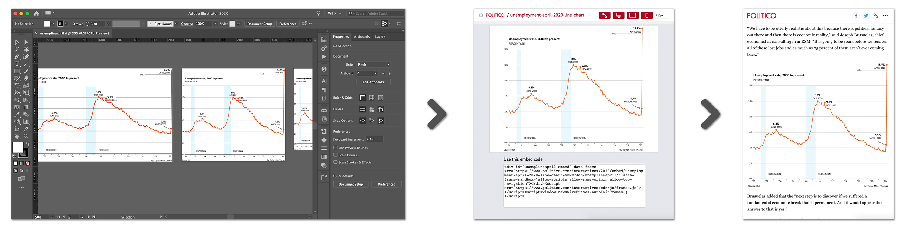
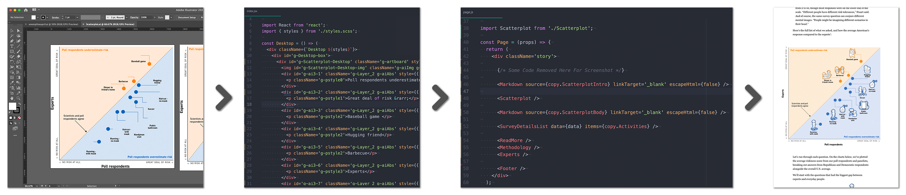

# Artisan v2.0

A suite of tools for creating & managing Adobe Illustrator based embeds. Heavily inspired by and built upon [ai2html](http://ai2html.org/).

## Contents
- [Why This?](#why-this)
- [How's It Work?](#hows-it-work)
- [Artisan In Action](#artisan-in-action)
- [Installation](#installation)

## Why This?


## How's It Work?

## Artisan In Action

### As An Embed
[This historical chart on the unemployment rate](https://www.politico.com/interactives/2020/embed/unemployment-april-2020-line-chart-hnNE7Ja6/preview/) was easily plugged into [a story](Unemployment soars to 14.7 percent in April amid coronavirus fallout) on the unemployment rate and [a deeper analysis](https://www.politico.com/news/2020/05/08/when-will-jobs-return-243925?Asks) on the future of the job market. The graphic designer built the chart completely in Adobe Illustrator, and then ran a single command to grab an embed code to use in any article page. You can see the [embed's repo here](https://github.com/The-Politico/illustration_unempline0420).


_A line graph is created in Adobe Illustrator at three breakpoints (left). Artisan publishes a preview page with an embed code (middle). That embed code is easily attached to any story (right)._

### As Part of a Story
A designer worked on [a single scatterplot](https://www.politico.com/interactives/2020/coronavirus-activity-risk-what-is-safe-poll/#g-Scatterplot-Desktop-img) showing the results of a survey in Adobe Illustrator. Then, she used Artisan to save her work as a component, which was slotted in with other interactive components to make a custom page. The designer didn't have to think about the page, and the developer imported the scatterplot the same way they would import any other piece of code. You can see the [story's repo here](https://github.com/The-Politico/interactive_coronavirus-activity-risk).


_A scatterplot is created in Adobe Illustrator at various breakpoints (first from left). Artisan exports the file as JSX (second) which can be easily imported and used like any other component (third) and integrates seamlessly (fourth)._


## Installation

### Prerequistes

**1. CLang and macOS Development Dependencies**
```zsh
xcode-select --install
```
**2. Rust**

```zsh
curl --proto '=https' --tlsv1.2 https://sh.rustup.rs -sSf | sh
```
