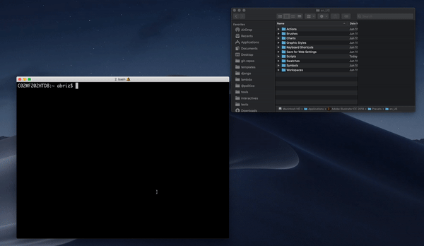

# ai2jsx

An Adobe Illustrator script for exporting Illustrator files as JSX components with CSS Modules attached. Built on the code powering [ai2html](http://ai2html.org/).

## Installation

1. Install the CLI.
```
$ npm install -g ai2jsx
```

2. Find your Adobe Illustrator scripts folder. Go to your Adobe Illustrator folder, then navigate to `Presets/en-US/`. You should see a folder called `Scripts` inside of that.

3. Install the `ai2jsx` script by running the CLI command and dragging the `Scripts` folder into the terminal. You'll probabaly need to `sudo` the command to have write access to that folder. See GIF below.

```
$ sudo ai2jsx install PATH_TO_YOUR_ILLUSTATOR_SCRIPTS
```



4. If that doesn't work, you can always copy the contents of the `install` directory of this repo into your `Scripts` folder directly.
